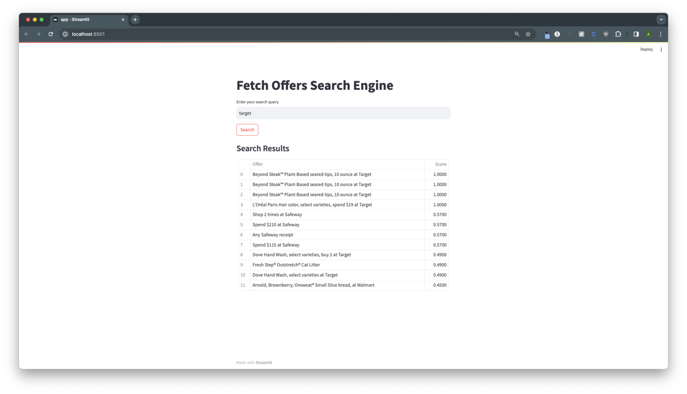
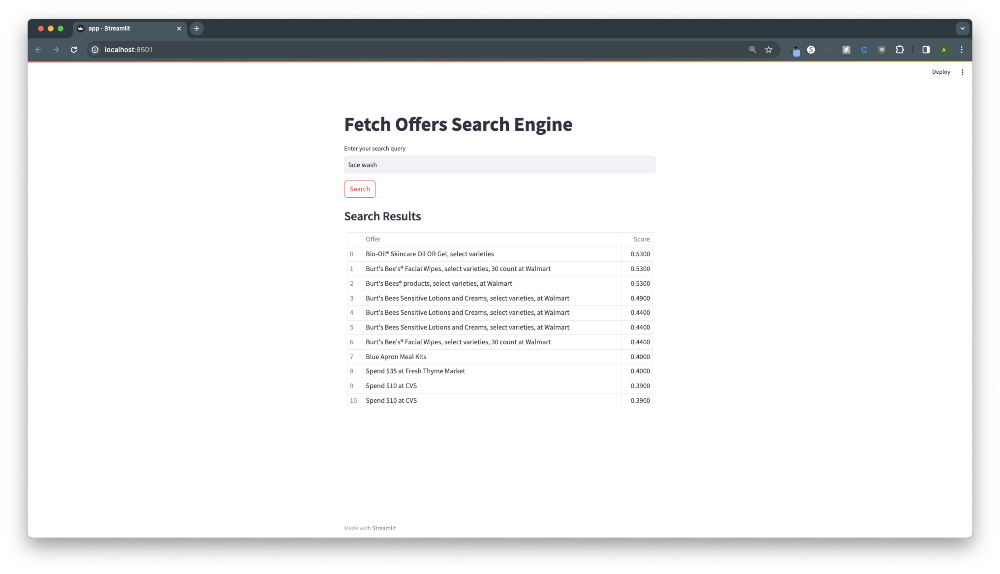
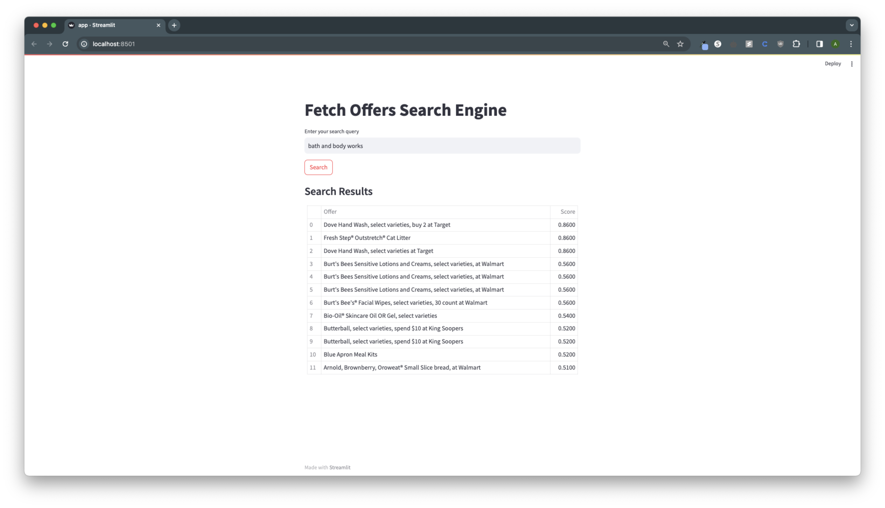

# Fetch Offers Search Engine

## Introduction

This application is a Streamlit-based search engine that leverages Elasticsearch's KNN capabilities and the Sentence Transformers library for semantic search. It's designed to help users find offers from various brands, categories, and retailers. The app offers a simple interface for entering search queries and displays relevant results.

## Features

- **Elasticsearch Integration**: Utilizes Elasticsearch for efficient data indexing and retrieval.
- **Semantic Search**: Employs the Sentence Transformers library for advanced query vectorization.
- **KNN Search**: Implements KNN search to find the most relevant offers.
- **User-friendly UI**: Provides an intuitive Streamlit interface for easy user interactions.

## System Requirements

- Python 3.6 or later
- Elasticsearch 7.x or later

## Installation Guide

### Step 1: Clone the Repository

Clone the GitHub repository to your local system:

```bash
git clone https://github.com/AkhilGurrapu/FetchSearchTool.git
cd FetchSearchTool
```


### Step 2: Set Up Python Environment
1. **Download Python**:
   - Download the latest version of Python 3.6 or later from the official [Python Downloads](https://www.python.org/downloads/) page.
   - Follow the installation instructions provided on the website.
2. **Set Up Python Virtual Environment (Optional but Recommended)**:
   - After installing Python, set up a virtual environment for the project:
     ```bash
     python -m venv venv
     ```
   - Activate the virtual environment:
     - On macOS and Linux:
       ```bash
       source venv/bin/activate
       ```
     - On Windows:
       ```bash
       venv\Scripts\activate
       ```

### Step 3: Install Dependencies
Install the required Python packages:

```bash
pip install streamlit
pip install elasticsearch
pip install sentence-transformers
```

### Step 4: Elasticsearch Installation
1. **Download Elasticsearch**:
   - Download Elasticsearch 7.x or later from the official [Elasticsearch Download](https://www.elastic.co/downloads/elasticsearch) page.
   - Follow the provided instructions to install and run Elasticsearch on your system.

2. **Configure Elasticsearch**:
   - Once installed, configure Elasticsearch to suit your application needs.
   - Ensure Elasticsearch service is running before starting the Streamlit application.

### Step 5: Elasticsearch Certificates
If using HTTPS for Elasticsearch, ensure certificates are correctly placed:

Update the path to the Elasticsearch certificate in the code (http_ca.crt in your example).

### Step 6: Sentence Transformers
Ensure the Sentence Transformers model (all-mpnet-base-v2) is accessible. It will be downloaded automatically if not present.

## Running the Application
### Start the Application

Launch the app using Streamlit:

```bash
Copy code
streamlit run app.py
```

### Accessing the App

The app will typically run at 'http://localhost:8501'. Open this address in a web browser.

### Screenshots





### Using the App

Input your search query.
Click "Search" to retrieve and display results.
